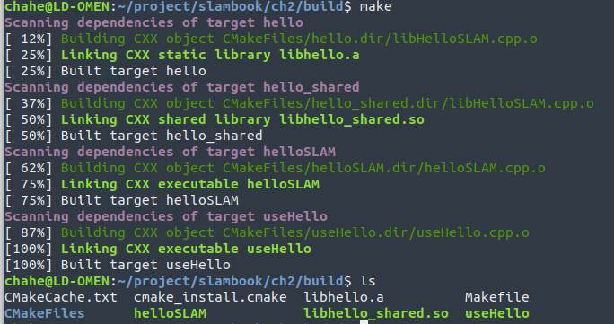
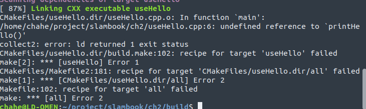
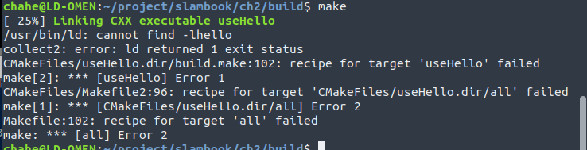

# NOTE

用 cmake来处理工程文件之间的关系，make实际调用了g++来编译程序。

通常把cmake生成的中间文件放到一个文件夹里，编译成功后删除。

用add_executable 来增加可执行文件。

## 如何使用库

```
# 添加一个库
add_library( hello libHelloSLAM.cpp )
# 共享库
add_library( hello_shared SHARED libHelloSLAM.cpp )

add_executable( useHello useHello.cpp )
# 将库文件链接到可执行程序上
target_link_libraries( useHello hello_shared )
```



从图中可以观察到，步骤如下

Link library

1. link static library(hello)
2. link shared library(hello_shared)

link exectable

1. built target helloSlam
2. builgt target useHello

需要注意的是，useHello 可以使用hello 或者hello_shared两种类型的库。

libhello是a为后缀，hello_shared 是.so 为后缀。

常见错误1：如果我们不进行**target_link_library**操作，在调用库的函数时会出错。



常见错误2：



忘记添加库（**add_library()**）

对应错误， cannot find -lxxx


区别， static library每次被调用都会生成一个副本， 动态库不会。

我们需要提供头文件，解释库里面都有啥。

